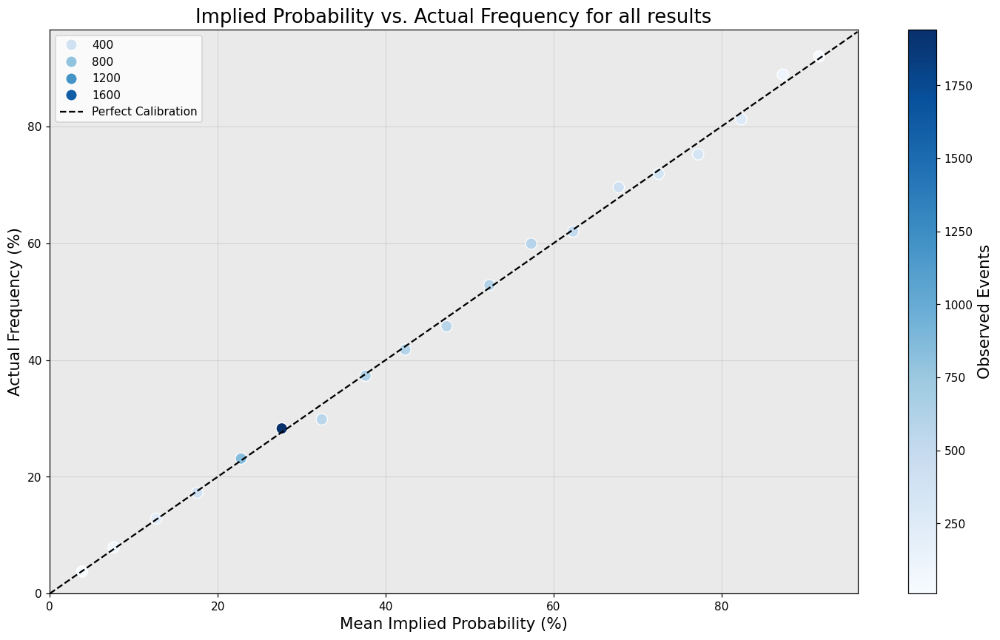

v# Premier League Odds Calibration, 2002/03 – 2025/26

Bookmakers publish prices, not probabilities. Convert the three outcomes of a football match into implied probabilities and they sum to between 102% and 108% rather than 100%, because a margin is built into every price. Remove that margin and a testable question remains: when Bet365 prices an outcome at 30%, does it happen 30% of the time?

This applies one calibration procedure to 9,120 Premier League fixtures across 24 seasons, then repeats it for each outcome and each month of the season.

## Method

The margin is removed with the **power method**, which solves for the exponent `k` such that the three quoted probabilities raised to `k` sum to 1. This is preferred to the naive reciprocal, which distributes the margin unevenly across outcomes and systematically distorts longshots.

Probabilities are grouped into 5-point bins. For each bin:

- **Expected successes** = Σ*p* over the fixtures in the bin
- **Variance** = Σ*p*(1−*p*), since the variances of independent 0/1 outcomes add
- **Error bars** = ±1.96 √variance, a 95% interval, drawn only where at least 5 successes and 5 failures are expected

Significance is tested with a **chi-squared goodness-of-fit** statistic using both cells of each bin — the events that happened and the events that did not. Adjacent bins are merged until each group holds at least 5 expected successes *and* 5 expected failures before the test is applied.

Forecast quality is measured with the **Brier score** against a base-rate benchmark: a forecaster who ignores the fixture and always quotes the long-run rate of that outcome.

## Results

### Calibration is good, but not as good as the aggregate suggests

<p align="center">
  
  
  
  
</p>

Pooled across all three outcomes, bins sit a mean of **0.93 percentage points** from perfect calibration, 17.61 points in total across 19 populated bins. Close, but not uniform: one bin, **30–35%**, falls outside its 95% interval, with 574 observed against 623.2 expected — a gap of 49.2 against a bar of ±40.2.

No combined chi-squared test is reported. Every fixture contributes three rows to the pooled table and exactly one of them succeeds, so those rows are perfectly dependent and the independence assumption the test requires does not hold.

### Per outcome

| | Mean error | as fixtures | χ² | bins | p |
|---|---|---|---|---|---|
| Home wins | +0.367% | +33.5 | 25.24 | 17 | **0.066** |
| Draws | +0.232% | +21.2 | 2.92 | 6 | 0.712 |
| Away wins | −0.600% | −54.7 | 9.94 | 17 | 0.870 |

No outcome is significantly miscalibrated at the 5% level. Home wins come closest: they occur about 33 times more often across the period than their prices imply, and the home p-value is an order of magnitude lower than the other two.

Mean error across all outcomes combined is ~10⁻¹⁴, which is an identity rather than a result — the three probabilities sum to 1 and exactly one outcome occurs — so it serves as a check on the margin removal.

### The draw market is well calibrated and nearly uninformative

| | Base rate | Brier | Brier, base rate only | Skill |
|---|---|---|---|---|
| Home wins | 45.6% | 0.2113 | 0.2481 | **14.8%** |
| Draws | 24.7% | 0.1831 | 0.1858 | **1.4%** |
| Away wins | 29.7% | 0.1773 | 0.2088 | **15.1%** |

Draws have the *lowest* Brier score of the three outcomes, which naively reads as the best-priced market. They are not — Brier is automatically low for rare events. Measured against a forecaster who quotes 24.7% on every fixture and never looks at the teams, Bet365's draw prices are only **1.4% better**, against roughly 15% for home and away wins.

So "Bet365 prices draws well" needs stating carefully: the draw prices are extremely well calibrated (χ² = 2.92 across 6 bins) and carry almost no information about *which* fixtures will be drawn. Pricing everything near the base rate is an easy way to be well calibrated and an uninformative way to be right. That reflects something real about football rather than a failing of the bookmaker.

### March

<p align="center">
  
  
  
</p>

Mean error is near zero in every month except March, where home wins and draws move in opposite directions — roughly mirror images.

> The notebook reports the raw monthly p-values. The Bonferroni-adjusted column below is computed here rather than in the notebook: it is simply `p × 30`, the 30 being 3 outcomes × 10 months (June and July are excluded as they contain only rescheduled Covid-era fixtures).

| | p | Bonferroni-adjusted |
|---|---|---|
| **March, draws** | **0.00046** | **0.014** |
| March, home wins | 0.032 | 0.96 |
| May, draws | 0.032 | 0.96 |

March draws produce 150 observed against 196.7 expected — **46.7 fewer than priced**, effect size *w* = 0.19. It is the only monthly result to survive correction for multiple comparisons, and it does so comfortably. March home wins move in the opposite direction but do not survive correction.

Whether this is a genuine seasonal effect or an artefact of fixture rescheduling is not resolved here.

### Would any of it have made money?

Flat-staking every fixture on a single outcome, at Bet365's own quoted prices, across all 24 seasons:

| | Total return | Mean ROI per season | Best season | Worst season |
|---|---|---|---|---|
| Home wins | −£2,693.59 | −2.95% | +9.48% | −18.41% |
| Draws | −£6,378.95 | −6.99% | +7.69% | −28.21% |
| Away wins | −£9,000.39 | −9.87% | +28.62% | −31.42% |

All three lose, which is what a 5.4% average margin buys the bookmaker. Calibration being close to correct and betting being unprofitable are entirely compatible: the margin sits on top of the prices, so even perfectly calibrated odds return less than stake over time.

## Limitations

- **These are pre-match odds, not closing odds.** football-data.co.uk publishes Bet365's closing line separately (`B365CH`/`CD`/`CA`), but only for 2,660 of the 9,120 fixtures, beginning around 2019/20. That count comes from the source CSVs directly — the notebook drops those columns during cleaning, so it does not appear in the analysis. The closing line is the efficient one, so testing openers is a different — and arguably more interesting — question, but it is a different question.
- **Matches are treated as independent.** They are not: injuries, managerial changes and league position all carry across fixtures. The chi-squared test assumes independence, and the p-values should be read with that in mind.
- **Binning discards information.** Five-point bins give usable sample sizes at the cost of resolution within each bin.
- **The March result is one finding among 30 tests.** It survives Bonferroni correction, but it was found by looking rather than predicted in advance.

## Data

Historical results and pre-match odds from [football-data.co.uk](https://www.football-data.co.uk/), Bet365's 1X2 market.

26 seasons were collected. The first two, 2000/01 and 2001/02, carry no Bet365 odds and are excluded, leaving 24 seasons and 9,120 fixtures from 2002/03 to 2025/26. One row with no date — a stray line in the source data rather than a fixture — is dropped.

## Running it

```bash
git clone https://github.com/Joshc386/premier-league-odds-analysis.git
cd premier-league-odds-analysis
jupyter lab BetProject.ipynb
```

The CSVs are in `PL_Data/` and are read by relative path, so Restart & Run All works from a clean clone. The figures in this README are written by the notebook itself, so they cannot drift from the analysis.

Python — pandas, NumPy, SciPy, matplotlib, seaborn, ipywidgets.

## The analysis

Full workflow, including the interactive per-season plots and the complete monthly breakdowns, is in [`BetProject.ipynb`](BetProject.ipynb).
