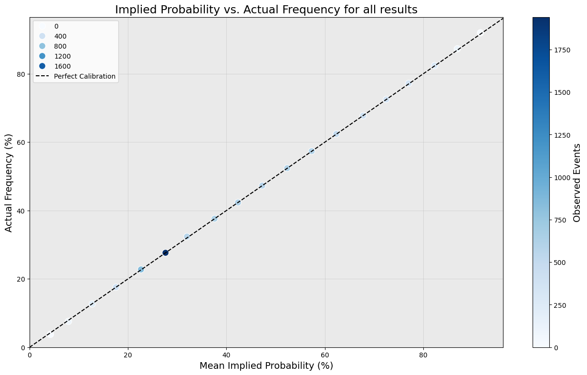
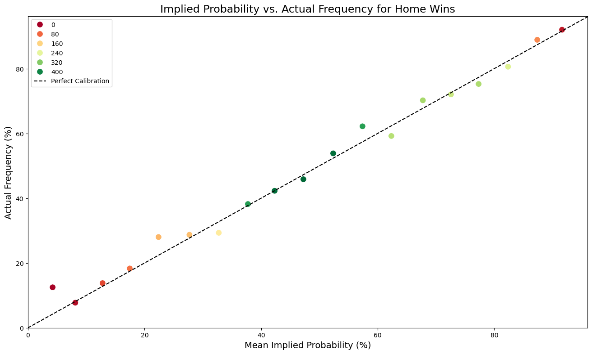
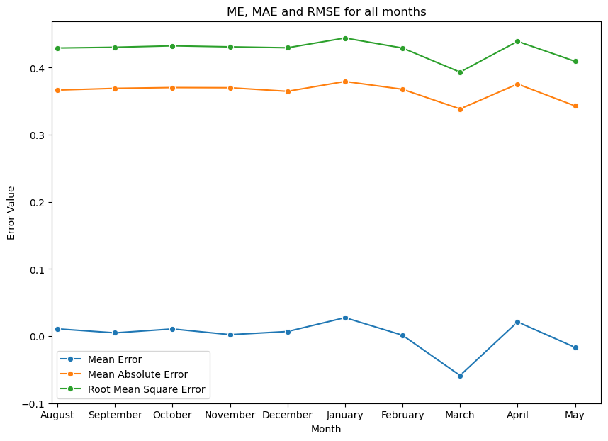

# Premier League Odds Calibration, 2002/03 – 2025/26

Bookmakers do not publish probabilities. They publish prices, and those prices carry a margin: convert the three outcomes of a football match into implied probabilities and they sum to something between 102% and 108% rather than 100%. Strip that margin out and a testable question remains — when Bet365 prices a result at 30%, does it happen 30% of the time?

This tests that question against 9,120 Premier League fixtures across 24 seasons.

## Findings

- **Aggregate calibration is close to exact.** Across all outcomes, the mean absolute deviation from perfect calibration is 0.14 percentage points per probability bin, with a chi-squared goodness-of-fit p-value of 0.979 — the observed results are almost indistinguishable from what the prices predicted.
- **That aggregate conceals real structure.** Split by outcome, home wins deviate by 2.13 points per bin against 0.72 for draws. Errors in one outcome are offset by the other two, so the combined figure looks better than any of its parts.
- **Home wins are mildly under-priced.** They occur 0.692% more often than the prices imply — around 31 fixtures over the period, or roughly 1.3 per season. Three bins (0–5%, 20–25% and 55–60%) account for nearly half the total deviation.
- **Draws are priced most tightly**, at 0.139% below expectation — three fixtures in 24 seasons. Around 85% of all draws are priced within the 20–30% band, occupying 6 probability bins against 19 for home wins.
- **March is the one statistically significant deviation.** Draws in March return p = 0.0052 with 46 fewer occurrences than expected. The effect size does not make it exploitable, and it is best read as a genuine anomaly rather than an edge.
- **Pricing appears to have changed after Covid.** The gap between mean and median implied probability narrowed from roughly 2 points to under 1, consistent with a revision to the underlying pricing model.

## Calibration

  
  

Every point on the left sits on the diagonal. On the right, the same method applied to home wins alone shows clear scatter, with several bins sitting well off the line in both directions. The left-hand chart is the one most analyses would stop at.

## Seasonal structure

  

Mean error sits near zero in every month except March, where it turns sharply negative. Mean absolute error and RMSE move together throughout, which is what makes the March divergence interpretable rather than noise.

## Data

Historical results and closing odds from [football-data.co.uk](https://www.football-data.co.uk/), using Bet365's 1X2 market.

26 seasons were collected. The first two, 2000/01 and 2001/02, contain no Bet365 odds and were excluded, leaving 24 seasons and 9,120 fixtures from 2002/03 to 2025/26.

## Method

1. **Margin removal.** The power method is used to convert the three quoted prices into probabilities summing to 1, rather than the naive reciprocal, which leaves the bookmaker's margin distributed unevenly across outcomes.
2. **Binning.** Implied probabilities are grouped into 5-point bins, with mean implied probability per bin computed across the constituent probabilities rather than taken from the bin midpoint.
3. **Calibration.** Predicted frequency per bin is tested against observed frequency, with error bars derived from the expected counts.
4. **Significance testing.** Chi-squared goodness-of-fit, with bin counts checked against the minimum expected-frequency assumption before the test is applied.
5. **Error metrics.** Mean error, mean absolute error and RMSE are reported alongside effect size, since mean error alone cancels opposing deviations to near zero.
6. **Segmentation.** The full procedure is repeated for home, draw and away outcomes independently, then by season and by month.

Where a result is statistically significant, effect size and raw count difference are reported alongside it.

## Tools

Python — pandas, NumPy, SciPy, matplotlib, seaborn, ipywidgets.

## The analysis

The full workflow, including the interactive plots and the per-season and per-month breakdowns, is in [`BetProject.ipynb`](BetProject.ipynb). If GitHub does not render it, it can be viewed via [nbviewer](https://nbviewer.org/).
